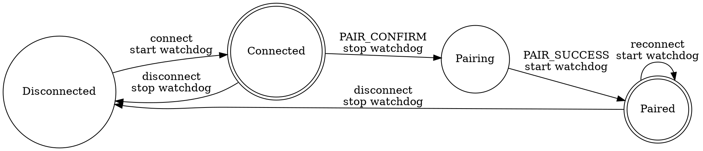

# BLE Light Sleep Power Management — Design

**Date:** 2026-06-13
**Status:** approved

## Problem

Light sleep enabled in `power_manager.cpp` causes a BLE disconnect loop on reconnection:

```
11:53:12 Connected → 11:53:20 KEEPALIVE send fails (0x800704C7 "cancelled by user")
→ "unhandled services changed event" → disconnected → reconnect → repeat
```

### Root Cause

`power_manager.cpp` calls `esp_light_sleep_start()` **directly** with no BLE coordination. ESP-IDF Power Management framework is NOT enabled (`CONFIG_PM_ENABLE=false`). When CPU wakes from light sleep, BLE controller state is inconsistent. NimBLE sends a "Service Changed" indication, which Windows bleak's winrt backend cannot handle — it cancels pending GATT operations, breaking the KEEPALIVE write and triggering disconnect.

### Why The Problem Only Appears With Light Sleep

When `esp_light_sleep_start()` was commented out, the CPU never entered light sleep. BLE state remained consistent. The "Service Changed" indication was never sent, so the bleak disconnect loop never triggered.

## Design

### Scope

Files changed:
- `firmware/sdkconfig` — enable ESP-IDF PM framework
- `firmware/main/config.h` — BLE connection interval to 100ms
- `firmware/main/power_manager.cpp` + `.h` — replace manual sleep with `esp_pm_lock`
- `firmware/main/ble_server.cpp` — connect/disconnect watchdog logic
- `firmware/main/main.cpp` — PAIR_CONFIRM/PAIR_SUCCESS watchdog handling

No changes to Python desktop-relay side.

### 1. SDK Configuration

```ini
# Enable ESP-IDF Power Management framework
CONFIG_PM_ENABLE=y

# Keep BLE RF/MAC powered during light sleep (BLE controller needs periph domain)
# CONFIG_PM_POWER_DOWN_PERIPHERAL_IN_LIGHT_SLEEP is not set (already off)

# CPU power-down during light sleep (already on)
CONFIG_PM_POWER_DOWN_CPU_IN_LIGHT_SLEEP=y
```

### 2. BLE Connection Interval

Increase connection interval to 100ms — more idle time between BLE connection events means CPU can stay in light sleep longer, saving more power:

```cpp
// config.h
#define BLE_CONN_INTERVAL_MIN  100  // ms (was 30)
#define BLE_CONN_INTERVAL_MAX  100  // ms (was 50)
```

Connection events every 100ms still provides responsive LED control while maximizing sleep opportunity.

### 3. Power Manager Rewrite

Old: manual timer + `esp_light_sleep_start()` (no BLE coordination)
New: `esp_pm_lock` API (framework coordinates with BLE controller automatically)

```cpp
// New interface (power_manager.h unchanged)
class PowerManager {
    void start();       // Create PM lock (not acquired yet)
    void enable();      // Acquire PM lock → allow light sleep
    void disable();     // Release PM lock → prevent sleep
    void on_activity(); // No-op (BLE data activity handled by framework)
};
```

**How it works:** When `enable()` is called (BLE connected), the PM lock is acquired. ESP-IDF framework automatically puts CPU into light sleep during BLE connection event gaps, waking up in time for the next connection event. Application code does nothing — the framework handles all timing.

**What disappears:**
- `g_idle_timer` FreeRTOS timer (no longer needed)
- `idle_timeout_cb()` callback
- Direct `esp_light_sleep_start()` call
- `on_activity()` timer reset logic

### 4. Watchdog Logic

| Event | Action |
|-------|--------|
| BLE connected | Start watchdog immediately |
| PAIR_CONFIRM received | Stop watchdog (user needs time to confirm dialog) |
| PAIR_SUCCESS received | (Re)start watchdog |
| BLE disconnected | Stop watchdog |

This handles both scenarios:
- **Already paired reconnect:** watchdog starts on connect, no PAIR_CONFIRM arrives, stays active — covers connection health
- **First pairing:** watchdog starts on connect → PAIR_CONFIRM arrives → watchdog paused → user confirms → PAIR_SUCCESS → watchdog restarts → health monitoring active

No NVS persistence needed.

### Watchdog Flow



### Non-Goals

- No changes to Python desktop-relay side
- No NVS persistence for pairing state
- No watchdog timeout changes (20s timeout stays; PAIR_CONFIRM cancel gives user unlimited pairing time)
- No modem sleep configuration (using light sleep via PM framework instead)

## Verification

1. Flash firmware with light sleep enabled → connect Python → verify no "services changed event" warning
2. Let device idle (no LED commands for 5s) → verify light sleep entry in logs
3. Send LED command while in light sleep → verify immediate response (framework wakes CPU for BLE event)
4. Disconnect → reconnect → verify clean reconnect without disconnect loop
5. Kill Python → restart Python → verify reconnect works
6. Repeat disconnect/reconnect 3 times to confirm reliability
